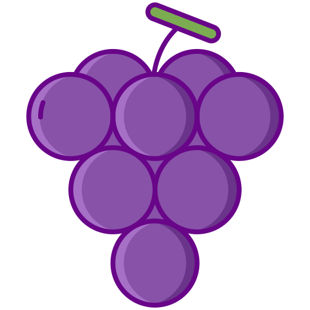

# Raisin



Control flow graph

from [kirshanthans cfg-clang](https://github.com/kirshanthans/cfg-clang)


## Dev

Build the container :
```sh
docker build . -t raisin:0.1
```

Build Raisin:
```sh
docker run -v $PWD:/disks/ramfs -it raisin:0.1
```

And run it :
```sh
docker run -v $PWD:/disks/ramfs -it raisin:0.1 bash

	out/poireau ../test/02.noinclude.cpp --
```

## Credits
icon: <div>Icons made by <a href="https://www.flaticon.com/authors/flat-icons" title="Flat Icons">Flat Icons</a> from <a href="https://www.flaticon.com/" title="Flaticon">www.flaticon.com</a></div>
